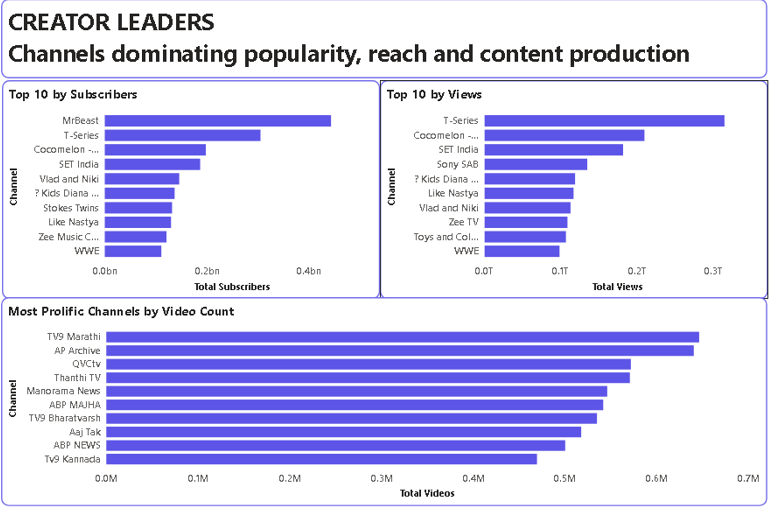
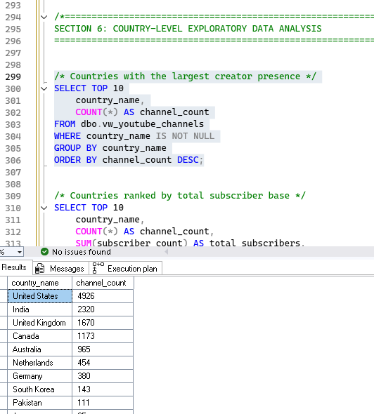
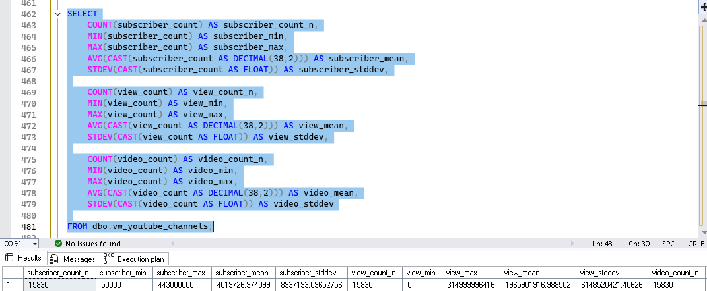
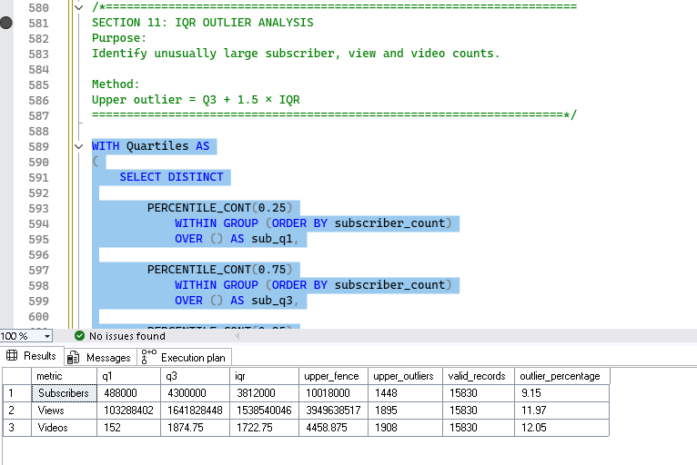

# YouTube Creator Performance Analysis

An end-to-end data analytics project exploring YouTube creator distribution, audience scale, content activity, and performance patterns across countries using SQL Server and Power BI.

The analysis uses a dataset containing **15,830 YouTube channels** and demonstrates a practical workflow from data validation and transformation to statistical analysis, visualization, and insight generation.

## Dashboard Preview



## Project Objective

The objective of this project is to explore YouTube creator performance from multiple perspectives rather than relying on a single metric.

The analysis examines:

- Creator distribution by country
- Subscriber and view distribution
- Average creator performance
- Content production activity
- Channel age
- Relationships between subscribers, views, and videos
- Statistical outliers
- Missing country information

## Business Questions

The analysis investigates the following questions:

1. Which countries have the largest creator representation in the dataset?
2. How are channels, subscribers, and views distributed across countries?
3. Does creator representation correspond to average creator performance?
4. Which channels have the highest subscriber, view, and video counts?
5. How does channel age relate to publishing activity?
6. What relationships exist between subscribers, views, and videos?
7. How much variation exists across creator metrics?
8. Which observations qualify as statistical outliers?
9. How significant is missing country information?

## Dataset

The dataset contains **15,830 YouTube channels** with 12 original fields.

| Field | Description |
|---|---|
| `channel_id` | Channel identifier |
| `channel_name` | Channel name |
| `view_count` | Total channel views |
| `category` | Channel category |
| `country` | Country code |
| `default_language` | Channel default language |
| `subscriber_count` | Subscriber count |
| `created_date` | Channel creation date |
| `description` | Channel description |
| `custom_url` | Channel custom URL |
| `thumbnail` | Channel thumbnail |
| `video_count` | Number of videos |

A country reference table was used to convert country codes into readable country names.

## Data Quality

The dataset was checked for missing values, duplicates, data types, and country mapping.

### Missing Values

| Field | Missing Records |
|---|---:|
| `channel_id` | 0 |
| `channel_name` | 0 |
| `subscriber_count` | 2 |
| `description` | 901 |
| `custom_url` | 22 |
| `country` | 1,800 |
| `default_language` | 14,105 |

### Duplicate Checks

| Field | Duplicate Records |
|---|---:|
| `channel_id` | 0 |
| `channel_name` | 48 |
| `custom_url` | 3 |
| `thumbnail` | 378 |

Duplicate channel names were not automatically treated as duplicate channels because different channels can have the same name. `channel_id` was therefore used as the channel-level identifier for uniqueness checks.

## Country Mapping

Country codes were mapped to readable country names using a reference table.

Examples:

| Code | Country |
|---|---|
| US | United States |
| IN | India |
| GB | United Kingdom |
| CA | Canada |
| AU | Australia |
| NG | Nigeria |

Channels without country information were retained rather than removed because approximately **1,800 channels** have no country information.

## SQL Analysis

SQL Server was used for:

- Data validation
- Data-type preparation
- Country-code mapping
- Analytical view creation
- Descriptive statistics
- Country-level analysis
- Creator-level analysis
- Correlation analysis
- Derived metrics
- Outlier analysis

### SQL Techniques

- `JOIN`
- `GROUP BY`
- `HAVING`
- `CASE`
- Common Table Expressions
- Window functions
- `PERCENTILE_CONT`
- `STDEV`
- `DATEDIFF`
- Conditional aggregation
- Pearson correlation

### SQL Analysis Preview







[View all SQL analysis screenshots](assets/)

## Derived Metrics

### Channel Age

```text
Channel Age = Days Since Creation / 365.25
````

This provides an approximate channel age in years.

### Views per Subscriber

```text
Views per Subscriber = Total Views / Subscriber Count
```

This compares accumulated views with the channel's subscriber count.

### Views per Video

```text
Views per Video = Total Views / Video Count
```

This compares accumulated views with the amount of content published.

### Videos per Year

```text
Videos per Year = Video Count / Channel Age
```

This provides an approximate measure of publishing activity over the channel's lifetime.

## Country-Level Analysis

Country-level analysis examines:

- Channel count
- Channel share
- Total subscribers
- Subscriber share
- Total views
- View share
- Average subscribers
- Average views

The largest country groups by channel count in the dataset include:

| Country | Channels |
|---|---:|
| United States | 4,926 |
| India | 2,320 |
| United Kingdom | 1,670 |
| Canada | 1,173 |
| Australia | 965 |

These figures describe country representation **within this dataset** and should not be interpreted as a complete count of YouTube creators in each country.

## Statistical Analysis

Descriptive statistics were calculated for:

- Subscriber count
- View count
- Video count

The analysis includes:

- Minimum
- Maximum
- Mean
- Standard deviation
- Q1
- Median
- Q3
- Interquartile range (IQR)

The IQR method was also used to identify unusually high observations.

Outlier analysis was applied to:

- Subscriber count
- View count
- Video count
- Views per subscriber
- Views per video
- Videos per year

Outliers were not automatically removed because extreme observations can represent legitimate high-performing channels.

## Relationship Analysis

Pearson correlation was used to examine relationships between major creator metrics.

### Subscribers and Views

Examines the relationship between subscriber count and accumulated views.

### Subscribers and Videos

Examines the relationship between audience size and content volume.

### Views and Videos

Examines the relationship between accumulated views and the number of uploaded videos.

Correlation measures association within the dataset and does not establish causation.

## Key Findings

### 1. Creator representation is concentrated

The dataset contains substantially more channels from some countries than others. The United States, India, United Kingdom, Canada, and Australia account for large portions of the channels represented in the dataset.

### 2. Creator representation and performance are different measures

A country having more channels does not automatically mean that its individual creators have the highest average subscriber or view counts.

For this reason, the analysis considers both total and average performance alongside channel representation.

### 3. Creator metrics vary considerably

Subscriber, view, and video counts show substantial variation between channels. This makes it important to consider distributions and median values alongside averages.

### 4. Missing country information is significant

Approximately **1,800 channels do not have country information**. Removing these records could affect country-level totals, so the records were retained and the missing information was made visible during analysis.

## Recommendations

### 1. Use multiple metrics for country comparisons

Channel count, total subscribers, total views, and average performance provide different perspectives and should not be treated as interchangeable.

### 2. Consider sample size

Country-level averages based on small numbers of channels may be less stable than averages based on larger groups.

### 3. Preserve missing-data visibility

Missing country information should remain visible when interpreting geographic analysis rather than being silently removed.

### 4. Use distribution-aware measures

Median and percentile-based measures provide additional context when extreme channels have a strong influence on averages.

## Power BI Dashboard

Power BI was used to transform the SQL analysis into an interactive dashboard.

The dashboard explores:

- Overall creator metrics
- Country performance
- Creator performance
- Content activity
- Geographic distribution
- Top channels
- Country-level exploration


[View dashboard screenshots](powerbi/screenshots/)

## Analytical Workflow

Raw Dataset
     ↓
Data Validation
     ↓
Data-Type Preparation
     ↓
Country Reference Mapping
     ↓
Analytical SQL View
     ↓
Descriptive Statistics
     ↓
Derived Metrics
     ↓
Relationship & Outlier Analysis
     ↓
Power BI Visualization
     ↓
Insights & Recommendations

## Limitations

### Dataset Coverage

The dataset represents the channels available in the supplied dataset and should not be interpreted as a complete census of YouTube creators.

### Missing Country Information

Approximately 1,800 channels have no country information.

### Uneven Country Representation

Countries are represented by different numbers of channels, so country comparisons should be interpreted alongside channel count.

### Accumulated Metrics

Subscriber, view, and video counts are channel-level accumulated measurements and do not necessarily represent recent performance.

### Correlation

Correlation identifies statistical association and does not establish causation.

### Channel Age

Metrics such as videos per year depend on channel age. Very young channels can produce unusually high rates because their age is a small denominator.

### Outliers

Large channels can strongly influence totals and averages. Outliers were therefore identified and examined rather than automatically removed.

## Tools Used

* SQL Server
* Power BI
* Excel
* GitHub

## Author

**Oluwapelumi Atanda**

Data Analytics | SQL | Power BI | Excel
